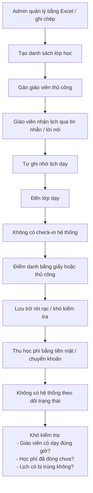
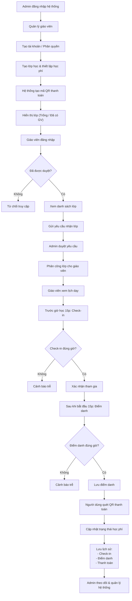

# BRD — Tài liệu Yêu cầu Nghiệp vụ 
## Tutoro - Phần mềm quản lí giảng dạy cho trung tâm giảng dạy về lập trình A
- Đây là hệ thống hư cấu : Trung tâm giảng dạy về lập trình A là hệ thống **hư cấu** được thiết kế cho mục đích học tập. Tên nhân vật, tổ chức và dữ liệu đều là giả lập.

| Thông tin tài liệu | |
|---|---|
| **Dự án** | Hệ thống Quản lý giảng dạy |
| **Phiên bản** | 1.0 |
| **Ngày tạo** | 16/04/2026 |
| **Người yêu cầu** | Ông Nguyễn Tùng Khánh — Giám đốc trung tâm giảng dạy về lập trình A (Khách hàng) |
| **Người tiếp nhận** | Ông Nguyễn Văn B — Trưởng dự án, Công ty phần mềm XYZ |

## 1. Bối cảnh

Trung tâm giảng dạy về lập trình A là một đơn vị đào tạo chuyên cung cấp các khóa học về lập trình và công nghệ thông tin cho học sinh, sinh viên và người đi làm. Trung tâm hiện đang tổ chức nhiều lớp học với các cấp độ khác nhau, từ cơ bản đến nâng cao, bao gồm các lĩnh vực như phát triển web, lập trình ứng dụng, và khoa học dữ liệu.

Hiện tại, việc quản lý hoạt động giảng dạy tại trung tâm vẫn đang được thực hiện chủ yếu bằng các phương pháp thủ công như sử dụng bảng tính (Excel), ghi chép hoặc các công cụ rời rạc. Điều này dẫn đến một số vấn đề như:

- Khó khăn trong việc theo dõi thông tin lớp học và học viên
- Dễ xảy ra sai sót khi nhập liệu và cập nhật dữ liệu
- Khó quản lý lịch giảng dạy và phân công giảng viên
- Thiếu hệ thống thống kê và báo cáo tổng thể
- Tốn nhiều thời gian cho các thao tác quản lý thủ công

Trước những hạn chế trên, trung tâm có nhu cầu xây dựng một hệ thống phần mềm quản lý giảng dạy nhằm tự động hóa các quy trình, nâng cao hiệu quả quản lý và cải thiện trải nghiệm cho cả giảng viên và người quản lý.

Hệ thống **Tutoro** được đề xuất nhằm đáp ứng các nhu cầu này, cung cấp một nền tảng tập trung giúp quản lý lớp học, học viên và lịch giảng dạy một cách khoa học, chính xác và dễ sử dụng.

## 2. Mục tiêu nghiệp vụ

| Mã   | Mục tiêu | Độ ưu tiên |
|------|----------|-----------|
| BO-01 | Số hóa toàn bộ quy trình quản lý giảng dạy (lớp học, giáo viên, lịch học) thay thế phương pháp thủ công | Cao |
| BO-02 | Cho phép Admin quản lý tài khoản giáo viên, bao gồm cấp quyền và duyệt đăng nhập | Cao |
| BO-03 | Đảm bảo chỉ giáo viên được Admin phê duyệt mới có thể truy cập hệ thống | Cao |
| BO-04 | Hỗ trợ Admin tạo lớp học và thông báo trạng thái lớp (trống / đã có giáo viên) | Cao |
| BO-05 | Cho phép giáo viên xem danh sách lớp và gửi yêu cầu nhận lớp | Cao |
| BO-06 | Hỗ trợ Admin duyệt và phân công lớp học cho giáo viên | Cao |
| BO-07 | Yêu cầu giáo viên check-in trước buổi học 15 phút để xác nhận tham gia giảng dạy | Cao |
| BO-08 | Yêu cầu giáo viên thực hiện điểm danh học sinh sau khi buổi học bắt đầu 15 phút | Cao |
| BO-09 | Tự động cảnh báo khi giáo viên check-in hoặc điểm danh trễ | Cao |
| BO-10 | Cung cấp chức năng quản lý và hiển thị lịch học theo ngày, tuần, tháng | Trung bình |
| BO-11 | Cho phép xem chi tiết buổi học và tổng số buổi học của mỗi lớp | Trung bình |
| BO-12 | Lưu trữ lịch sử hoạt động của giáo viên và lớp học | Trung bình |
| BO-13 | Cung cấp giao diện đơn giản, dễ sử dụng cho Admin và giáo viên | Cao |
| BO-14 | Hỗ trợ thanh toán học phí nhanh chóng thông qua mã QR | Cao |
| BO-15 | Theo dõi trạng thái thanh toán của từng lớp học | Cao |

## 3. Phạm vi dự án

### 3.1. Trong phạm vi (In-scope)

- Xây dựng hệ thống quản lý giảng dạy đa nền tảng (mobile).
- Chức năng đăng ký, đăng nhập cho Admin.
- Giáo viên đăng nhập sau khi được Admin phê duyệt tài khoản.
- Quản lý tài khoản giáo viên (tạo, duyệt, phân quyền).
- Tạo và quản lý lớp học.
- Hiển thị trạng thái lớp học (trống / đã có giáo viên).
- Giáo viên gửi yêu cầu nhận lớp.
- Admin duyệt và phân công lớp cho giáo viên.

- Quản lý lịch học theo:
  - Ngày / Tuần / Tháng
- Giáo viên xem lịch dạy.

- Check-in trước buổi học 15 phút.
- Điểm danh học sinh sau khi bắt đầu 15 phút.
- Hệ thống cảnh báo khi thực hiện trễ.

- Quản lý học phí lớp học:
  - Tạo thông tin học phí cho từng lớp
  - Hiển thị trạng thái thanh toán

- Thanh toán học phí bằng mã QR:
  - Tạo mã QR cho từng lớp học
  - Người dùng quét mã để thanh toán
  - Cập nhật trạng thái đã thanh toán

- Lưu lịch sử hoạt động:
  - Check-in
  - Điểm danh
  - Thanh toán

---

### 3.2. Ngoài phạm vi (Out-of-scope)

- Tích hợp cổng thanh toán phức tạp (VNPay, MoMo API thật)
- Hoàn tiền (refund)
- Hệ thống hóa đơn điện tử
- Chat realtime
- AI gợi ý
- Báo cáo nâng cao

# 4. Quy trình nghiệp vụ hiện tại (As-Is)

### Vấn đề chính:
- Quản lý thủ công → dễ sai sót
- Không kiểm soát được check-in và điểm danh
- Không có cảnh báo trễ giờ
- Không theo dõi được trạng thái học phí
- Lịch học dễ bị trùng hoặc thiếu đồng bộ

# 5. Quy trình nghiệp vụ mong muốn (To-Be)
