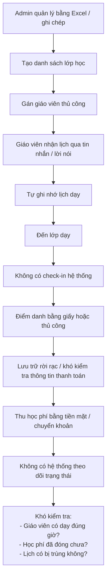
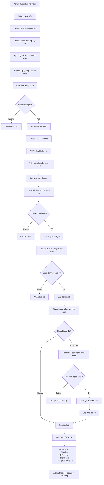

# BRD — Tài liệu Yêu cầu Nghiệp vụ 
## Tutoro - Phần mềm quản lí giảng dạy cho trung tâm giảng dạy về lập trình A
- Đây là hệ thống hư cấu : Trung tâm giảng dạy về lập trình A là hệ thống **hư cấu** được thiết kế cho mục đích học tập. Tên nhân vật, tổ chức và dữ liệu đều là giả lập.

| Thông tin tài liệu | |
|---|---|
| **Dự án** | Hệ thống Quản lý giảng dạy |
| **Phiên bản** | 1.0 |
| **Ngày tạo** | 16/04/2026 |
| **Người yêu cầu** | Ông Nguyễn Tùng Khánh — Giám đốc trung tâm giảng dạy về lập trình A (Khách hàng) |
| **Người tiếp nhận** | Ông Nguyễn Văn B — Trưởng dự án, Công ty phần mềm XYZ |

## 1. Bối cảnh

Trung tâm giảng dạy về lập trình A là một đơn vị đào tạo chuyên cung cấp các khóa học về lập trình và công nghệ thông tin cho học sinh, sinh viên và người đi làm. Trung tâm hiện đang tổ chức nhiều lớp học với các cấp độ khác nhau, từ cơ bản đến nâng cao, bao gồm các lĩnh vực như phát triển web, lập trình ứng dụng, và khoa học dữ liệu.

Hiện tại, việc quản lý hoạt động giảng dạy tại trung tâm vẫn đang được thực hiện chủ yếu bằng các phương pháp thủ công như sử dụng bảng tính (Excel), ghi chép hoặc các công cụ rời rạc. Điều này dẫn đến một số vấn đề như:

- Khó khăn trong việc theo dõi thông tin lớp học và học viên
- Dễ xảy ra sai sót khi nhập liệu và cập nhật dữ liệu
- Khó quản lý lịch giảng dạy và phân công giảng viên
- Thiếu hệ thống thống kê và báo cáo tổng thể
- Tốn nhiều thời gian cho các thao tác quản lý thủ công

Trước những hạn chế trên, trung tâm có nhu cầu xây dựng một hệ thống phần mềm quản lý giảng dạy nhằm tự động hóa các quy trình, nâng cao hiệu quả quản lý và cải thiện trải nghiệm cho cả giảng viên và người quản lý.

Hệ thống **Tutoro** được đề xuất nhằm đáp ứng các nhu cầu này, cung cấp một nền tảng tập trung giúp quản lý lớp học, học viên và lịch giảng dạy một cách khoa học, chính xác và dễ sử dụng.

## 2. Mục tiêu nghiệp vụ

| Mã   | Mục tiêu | Độ ưu tiên |
|------|----------|-----------|
| BO-01 | Số hóa toàn bộ quy trình quản lý giảng dạy (lớp học, giáo viên, lịch học) thay thế phương pháp thủ công | Cao |
| BO-02 | Cho phép Admin quản lý tài khoản giáo viên, bao gồm cấp quyền và duyệt đăng nhập | Cao |
| BO-03 | Đảm bảo chỉ giáo viên được Admin phê duyệt mới có thể truy cập hệ thống | Cao |
| BO-04 | Hỗ trợ Admin tạo lớp học và thông báo trạng thái lớp (trống / đã có giáo viên) | Cao |
| BO-05 | Cho phép giáo viên xem danh sách lớp và gửi yêu cầu nhận lớp | Cao |
| BO-06 | Hỗ trợ Admin duyệt và phân công lớp học cho giáo viên | Cao |
| BO-07 | Yêu cầu giáo viên check-in trước buổi học 15 phút để xác nhận tham gia giảng dạy | Cao |
| BO-08 | Yêu cầu giáo viên thực hiện điểm danh học sinh sau khi buổi học bắt đầu 15 phút | Cao |
| BO-09 | Tự động cảnh báo khi giáo viên check-in hoặc điểm danh trễ | Cao |
| BO-10 | Cung cấp chức năng quản lý và hiển thị lịch học theo ngày, tuần, tháng | Trung bình |
| BO-11 | Cho phép xem chi tiết buổi học và tổng số buổi học của mỗi lớp | Trung bình |
| BO-12 | Lưu trữ lịch sử hoạt động của giáo viên và lớp học | Trung bình |
| BO-13 | Cung cấp giao diện đơn giản, dễ sử dụng cho Admin và giáo viên | Cao |
| BO-14 | Hỗ trợ thanh toán học phí linh hoạt thông qua mã QR cho từng học sinh | Cao |
| BO-15 | Theo dõi số dư học phí của từng học sinh và trạng thái thanh toán | Cao |
| BO-16 | Tự động xử lý học sinh không đủ học phí (cảnh báo hoặc loại khỏi lớp) | Cao |

## 3. Phạm vi dự án

### 3.1. Trong phạm vi (In-scope)

- Xây dựng hệ thống quản lý giảng dạy đa nền tảng (mobile).
- Chức năng đăng ký, đăng nhập cho Admin.
- Giáo viên đăng nhập sau khi được Admin phê duyệt tài khoản.
- Quản lý tài khoản giáo viên (tạo, duyệt, phân quyền).
- Tạo và quản lý lớp học.
- Hiển thị trạng thái lớp học (trống / đã có giáo viên).
- Giáo viên gửi yêu cầu nhận lớp.
- Admin duyệt và phân công lớp cho giáo viên.

- Quản lý lịch học theo:
  - Ngày / Tuần / Tháng
- Giáo viên xem lịch dạy.

- Check-in trước buổi học 15 phút.
- Điểm danh học sinh sau khi bắt đầu 15 phút.
- Hệ thống cảnh báo khi thực hiện trễ.

- Quản lý học phí lớp học:
  - Tạo thông tin học phí cho từng lớp
  - Hiển thị trạng thái thanh toán

- Thanh toán học phí bằng mã QR:
  - Tạo mã QR cho từng học sinh hết phí
  - Giáo viên xem mã QR cho học sinh thanh toán
  - Cập nhật trạng thái đã thanh toán

- Lưu lịch sử hoạt động:
  - Check-in
  - Điểm danh
  - Thanh toán của từng học sinh

---

### 3.2. Ngoài phạm vi (Out-of-scope)

- Tích hợp cổng thanh toán phức tạp (VNPay, MoMo API thật)
- Hoàn tiền (refund)
- Hệ thống hóa đơn điện tử
- Chat realtime
- AI gợi ý
- Báo cáo nâng cao

# 4. Quy trình nghiệp vụ hiện tại (As-Is)

### Vấn đề chính:
- Quản lý thủ công → dễ sai sót
- Không kiểm soát được check-in và điểm danh
- Không có cảnh báo trễ giờ
- Không theo dõi được trạng thái học phí
- Lịch học dễ bị trùng hoặc thiếu đồng bộ

# 5. Quy trình nghiệp vụ mong muốn (To-Be)

## 6. Quy tắc nghiệp vụ

| Mã | Quy tắc | Chi tiết |
|----|---------|---------|
| BR-01 | Phân quyền người dùng | Chỉ **Admin** có quyền tạo tài khoản và phân quyền cho giáo viên |
| BR-02 | Điều kiện đăng nhập giáo viên | Giáo viên chỉ được đăng nhập khi tài khoản đã được **Admin phê duyệt** |
| BR-03 | Phân công lớp học | Một lớp học chỉ được gán cho **một giáo viên** tại một thời điểm |
| BR-04 | Nhận lớp | Giáo viên phải gửi yêu cầu và được **Admin duyệt** trước khi nhận lớp |
| BR-05 | Check-in | Giáo viên phải check-in **trước giờ học 15 phút** |
| BR-06 | Check-in trễ | Nếu check-in sau thời gian quy định → hệ thống hiển thị **cảnh báo trễ** |
| BR-07 | Điểm danh | Giáo viên phải điểm danh sau khi buổi học bắt đầu **15 phút** |
| BR-08 | Điểm danh trễ | Nếu điểm danh muộn → hệ thống hiển thị **cảnh báo** |
| BR-09 | Quản lý lịch học | Lịch học được quản lý theo **ngày / tuần / tháng** |
| BR-10 | Quản lý học phí | Mỗi học sinh có **số dư học phí riêng** |
| BR-11 | Điều kiện học | Học sinh chỉ được tiếp tục học khi **số dư học phí > 0** |
| BR-12 | Thanh toán học phí | Học sinh có thể thanh toán học phí thông qua **mã QR** |
| BR-13 | Cập nhật thanh toán | Sau khi thanh toán thành công, hệ thống phải **cập nhật số dư học phí** |
| BR-14 | Không thanh toán | Nếu học sinh không thanh toán khi hết học phí → **bị loại khỏi lớp** |
| BR-15 | Theo dõi học phí | Giáo viên có quyền xem **trạng thái học phí** nhưng không được chỉnh sửa |
| BR-16 | Lưu lịch sử | Hệ thống phải lưu lại toàn bộ hoạt động: **check-in, điểm danh, thanh toán** |
| BR-17 | Trạng thái lớp học | Lớp học có 2 trạng thái: **Trống / Đã có giáo viên** |
| BR-18 | Bảo mật dữ liệu | Người dùng chỉ được truy cập các chức năng theo **vai trò được phân quyền** |
| BR-19 | Thời gian gia hạn thanh toán | Học sinh được phép thanh toán trong khoảng thời gian nhất định trước khi bị loại |

## 7. Các bên liên quan (Stakeholders)

| Vai trò | Người đại diện | Mối quan tâm chính |
|---------|---------------|-------------------|
| Giám đốc trung tâm (Customer) | Ông Nguyễn Tùng Khánh | Hệ thống hoạt động ổn định, quản lý hiệu quả lớp học, giáo viên và học phí |
| Admin (End User) | Nhân viên quản lý | Dễ dàng quản lý tài khoản giáo viên, phân công lớp, theo dõi lịch học và học phí |
| Giáo viên (End User) | Các giảng viên | Xem lịch dạy rõ ràng, nhận lớp nhanh, check-in và điểm danh thuận tiện |
| Học sinh (End User) | Học viên trung tâm | Theo dõi lịch học, trạng thái học phí, thanh toán dễ dàng qua QR |
| Nhà phát triển (Developer) | Nhóm phát triển phần mềm | Hệ thống rõ ràng, dễ bảo trì, dễ mở rộng |

## 8. Ràng buộc và giả định

### Ràng buộc:
- Sử dụng **Flutter + Dart** để phát triển ứng dụng đa nền tảng (mobile).
- Áp dụng mô hình **MVC** trong thiết kế hệ thống.
- Sử dụng database: **MySQL hoặc SQLite**.
- Không tích hợp cổng thanh toán thực tế (VNPay, MoMo), chỉ sử dụng **QR giả lập**.
- Thời gian phát triển: **4–6 tuần**.

---

### Giả định:
- Số lượng giáo viên: 5–10 người.
- Số lượng lớp học: 10–20 lớp.
- Số lượng học sinh mỗi lớp: 10–30 học sinh.
- Người dùng sử dụng ứng dụng trên thiết bị di động (Android là chính).
- Hệ thống hoạt động online, có kết nối internet.
- Thanh toán QR chỉ mang tính mô phỏng (không kết nối ngân hàng thật).

---

## 9. Tiêu chí nghiệm thu

| Mã | Tiêu chí | Phương pháp kiểm tra |
|----|---------|---------------------|
| AC-01 | Admin đăng ký và đăng nhập thành công | Nhập thông tin hợp lệ → Vào hệ thống |
| AC-02 | Giáo viên không thể đăng nhập khi chưa được duyệt | Đăng nhập → Bị từ chối |
| AC-03 | Admin tạo tài khoản giáo viên thành công | Tạo → Giáo viên xuất hiện trong danh sách |
| AC-04 | Giáo viên gửi yêu cầu nhận lớp | Gửi yêu cầu → Admin thấy request |
| AC-05 | Admin duyệt và phân công lớp cho giáo viên | Duyệt → Lớp cập nhật giáo viên |
| AC-06 | Giáo viên check-in đúng thời gian | Check-in trước 15p → Thành công |
| AC-07 | Cảnh báo khi giáo viên check-in trễ | Check-in muộn → Hiển thị cảnh báo |
| AC-08 | Giáo viên điểm danh đúng quy định | Điểm danh sau 15p → Lưu thành công |
| AC-09 | Cảnh báo khi điểm danh trễ | Điểm danh muộn → Hiển thị cảnh báo |
| AC-10 | Hiển thị lịch học theo ngày/tuần/tháng | Chọn chế độ → Hiển thị đúng |
| AC-11 | Hiển thị số dư học phí của học sinh | Xem lớp → Hiển thị đúng số dư |
| AC-12 | Thanh toán học phí bằng QR thành công | Quét QR → Cập nhật số dư |
| AC-13 | Học sinh không đủ học phí bị xử lý | Không thanh toán → Bị loại khỏi lớp |
| AC-14 | Lưu lịch sử hoạt động | Thực hiện thao tác → Có log lưu lại |
| AC-15 | Phân quyền đúng vai trò | Admin/GV → Truy cập đúng chức năng |

---

## 10. Lịch trình mong muốn

| Giai đoạn | Thời gian | Sản phẩm |
|-----------|----------|---------|
| Phân tích yêu cầu | Tuần 1 | BRD + SRS hoàn chỉnh |
| Thiết kế hệ thống | Tuần 2 | Database, UML Diagram |
| Phát triển | Tuần 3–4 | Ứng dụng Flutter hoàn chỉnh |
| Kiểm thử | Tuần 5 | Báo cáo test, fix bug |
| Hoàn thiện & Bàn giao | Tuần 6 | Hệ thống sẵn sàng demo |

---
## 11. Ghi chú cho phát triển

### 11.1 Kiến trúc hệ thống
- Áp dụng mô hình MVC
- Tách riêng:
  - Model (Data)
  - View (UI Flutter)
  - Controller (Logic xử lý)

### 11.2 Công nghệ sử dụng
- Flutter + Dart
- Database: MySQL / SQLite
- QR: sử dụng thư viện generate QR (mock)

### 11.3 Quy ước xử lý

- Check-in:
  - So sánh thời gian hiện tại với thời gian bắt đầu lớp
- Điểm danh:
  - Chỉ cho phép sau khi bắt đầu 15 phút
- Học phí:
  - Lưu dạng số dư (balance)
  - Trừ dần theo buổi hoặc gói

### 11.4 Xử lý lỗi

- Sai quyền → trả về "Unauthorized"
- Check-in trễ → trả về cảnh báo (không block)
- Không đủ học phí → block hoặc remove học sinh

### 11.5 Logging

- Ghi log:
  - Check-in
  - Điểm danh
  - Thanh toán
  - Phân công lớp

---

## Ký duyệt

| | Họ tên | Chức vụ | Ngày |
|---|--------|--------|------|
| **Người yêu cầu** | Nguyễn Tùng Khánh | Giám đốc trung tâm (Customer) | 16/04/2026 |
| **Người tiếp nhận** | Nguyễn Văn B | Trưởng dự án / PM | 16/04/2026 |